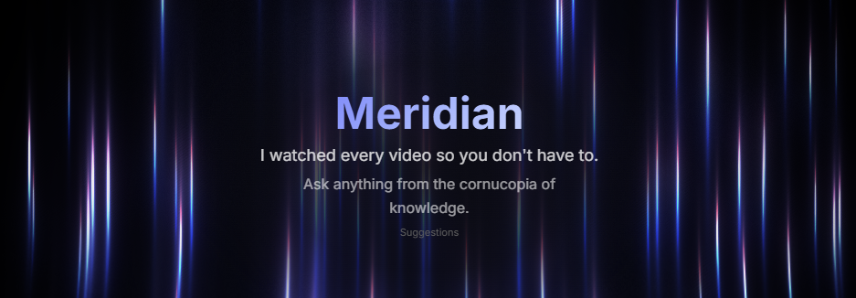

<div align="center">


# Meridian Sage

### Your personal AI consultant, grounded entirely in what experts actually said.

*249,641 transcript chunks · 91 curated channels · 15 topic domains · zero hallucinations*

<br>


<br>

</div>

---

## Why I built this

Picture a gigantic library with books covering every subject you care about: investing, science, business, psychology, history, philosophy. You want to know the best way to make a beef wellington. Without a librarian who has read everything, you are on your own, every page, every book, compiled by hand.

That's YouTube. Thousands of hours of lectures, interviews, and talks from some of the most qualified people alive, locked in a format you can't search or query on demand. You watch something useful on a Tuesday, forget it by Thursday, and there's no way to get it back. The knowledge exists. It's just completely inaccessible when you actually need it.

Meridian fixes that. It scrapes, indexes, and makes the content of 91 expert YouTube channels queryable through a chat interface. It's actively used in production, not a demo.



---

## What it does

Ask a question in plain English. Meridian runs it against 249,641 indexed transcript chunks from channels across AI, business, investing, science, health, history, philosophy and more. The top results, ranked by a 7-stage retrieval pipeline, go to Gemini 2.0 Flash, which writes a direct answer in prose.

Every factual claim in the response is backed by a `[SRC]` citation linking to the exact second in the source video where it was said. Not a summary. The actual moment, timestamped, clickable.

Type "claued coed" instead of "claude code" and it corrects the typo before searching. If you aren't sure how to phrase something, Meridian silently generates 3 paraphrased variants of your query and merges the results, so vocabulary gaps between how you ask and how an expert said the answer three years ago don't cost you anything. If the knowledge base genuinely has nothing, it falls back to a live DuckDuckGo web search automatically, guaranteeing zero dead ends.

---

## Why general AI models aren't enough

General AI models hallucinate. Ask ChatGPT what a YC partner said about pricing in 2022 and it guesses confidently, fluently, incorrectly. It doesn't have context from 5,000 specific videos. It has fuzzy training knowledge and whatever it can scrape in real time.

Meridian runs on a zero-hallucination protocol. Every answer must cite exactly where its information comes from before it gets returned. The sources are 91 hand-curated channels chosen for depth and credibility, not the open internet or model weights. If a high-confidence source doesn't exist in the knowledge base, Meridian says so instead of making something up.

Any general AI model gives you a city block. Meridian gives you the exact adress down to the meter.

---

## The library

91 channels picked for quality, not quantity. No entertainment, no reaction content, it's all pure expertise.

| Domain | Channels |
|--------|----------|
| AI / Tech | @ycombinator, @AndrejKarpathy, @lexfridman, @3blue1brown, @Computerphile, @geohotarchive, @YannicKilcher + more |
| Business / Entrepreneurship | @AcquiredFM, @DavidSenra, @a16z, @GarryTan, @MyFirstMillionPod, @HarvardBusinessReview + more |
| Investing / Finance | @PBoyle, @aswathdamodaranonvaluation, @ThePlainBagel, @EconomicsExplained + more |
| Science | @veritasium, @kurzgesagt, @pbsspacetime, @RealEngineering, @Fermilab + more |
| Psychology / Behavior | @JordanBPeterson, @hubermanlab, @modernwisdompodcast, @bigthink + more |
| Health / Longevity | @PeterAttiaMD, @JeffNippard, @FoundMyFitness, @BryanJohnson + more |
| History / Geopolitics | @WendoverProductions, @CaspianReport, @KingsandGenerals, @fallofcivilizations + more |
| Philosophy | @einzelganger, @academyofideas, @philosophizethis, @TheSchoolofLife + more |
| + 7 more domains | Sales, Product, Leadership, Law, Real Estate, Communication, Productivity |

<!-- [SCREENSHOT: Channels tab in the sidebar — category filter pills across the top (AI/Tech, Business, Investing, etc.), channel list below with handles and video counts] -->

---

## How the retrieval works

A query doesn't get thrown at a search index. It runs through 7 stages before Gemini sees anything.

**Stage 0.** A single Gemini call at temperature 0.4 corrects typos and generates 3 paraphrased variants. "What makes a good cofounder" becomes 4 distinct queries. This closes the vocabulary gap between how you ask and how someone actually answered on camera.

**Stage 1.** Each variant runs two searches at once: ChromaDB cosine similarity for semantic meaning, and BM25Okapi for exact keyword matching. Semantic search alone breaks on proper nouns and specific terms. "Sequoia RFS 2024" has no meaningful embedding neighbors — BM25 matches the tokens directly. Scores combine at `0.7 × semantic + 0.3 × BM25_normalized`.

**Stage 2.** Results from all 4 variants merge into one ranked list. Highest score per chunk wins, the duplicates dropped.

**Stage 3.** If the best score sits below 0.30, the knowledge base doesn't have a confident answer. Meridian falls back to DuckDuckGo automatically, same format, same citation style.

**Stage 4.** A separate ChromaDB collection, one document per video, gets queried independently. Chunks from videos whose title and description strongly match the query get a +0.20 score boost. This recovers relevant content buried deep in a matching video that chunk-level search would have missed.

**Stage 5.** The top 30 candidates go through `ms-marco-MiniLM-L-6-v2`, a cross-encoder. Earlier stages compared query and chunks as separate vectors. The cross-encoder sees both as a single input, which produces a far sharper relevance signal. It only runs on 30 candidates because it's slower, but it's the stage that makes the final ranking trustworthy and most definitely worth it.

**Stage 6.** Top 8 re-ranked chunks, formatted with title and timestamps, go to Gemini 2.0 Flash with one hard rule: every factual claim cites `[SRC_N]`, no exceptions, no training knowledge used. The response streams back to the frontend with citations rendered as superscripts, each one a direct link to the exact YouTube second.

---

## Engineering challenges overcome

**YouTube blocks you at scale.** The transcript API rate-limits aggressively by IP. Indexing 91 channels meant scraping tens of thousands of videos across weeks. The solution was to decouple scraping from embedding entirely. Scraping runs from a mobile hotspot with IP rotation between sessions; embedding, which never touches YouTube, runs separately from a stable connection afterward. Both layers are fully incremental, SQLite commits after every single video, ChromaDB checks existing chunk IDs before embedding. An interrupted run loses nothing.

**Semantic search isn't enough on its own.** The first version used pure cosine similarity and failed in ways that were obvious in practice: "letting someone go" didn't surface chunks about "firing employees," proper nouns had no embedding neighbors, and relevant videos ranked low because one keyword didn't exist in the vector space. Each layer of the retrieval pipeline was added to fix a specific failure observed in real queries. BM25 for exact token matching. Metadata boosting for video-level relevance. The cross-encoder as the final precision pass. None of these were planned up front.

**The original architecture was destroying the budget.** The first version ran through Claude Desktop via an MCP server. Every tool call result persisted in the context window for the entire conversation. Five searches burned roughly 10,000 tokens permanently. One deep research session could wipe out a week's Claude Pro quota.

The fix was cutting Claude out of the retrieval loop entirely. Gemini 2.0 Flash replaced it on Vertex AI, not because of brand preference, but because it's a lightweight model built specifically for parsing structured retrieved data and writing coherent prose from it. It's faster, cheaper, and genuinely better at this task than a general-purpose model. Cost per query dropped to about $0.003. A purpose-built Next.js frontend replaced Claude Desktop, giving full control over the pipeline, the citation format, and the UX.

<!-- [SCREENSHOT: hero screen — animated WebGL background, Meridian globe logo in the top bar, suggestion cards showing, floating glassmorphism input bar at the bottom] -->

<!-- START TECHNICAL README -->
 
---
 
## Architecture
 
```
YouTube
   ↓
pipeline.py          scrape + embed (yt-dlp, youtube-transcript-api)
   ↓           ↓
knowledge.db   yc_vectors/          SQLite + ChromaDB (generated, not in repo)
                   ↓
            bm25_cache.pkl          BM25 index built on first API start (generated)
                   ↓
             api/  (FastAPI)        hybrid search + Gemini synthesis
                   ↓
           sage_chat/ (Next.js)     chat UI
```
 
`pipeline.py` handles two-layer ingestion. Layer 1 scrapes YouTube channels into SQLite (`knowledge.db`). Layer 2 chunks transcripts and embeds them into ChromaDB (`yc_vectors/`). Incremental, already-processed videos are skipped at both layers.
 
`api/` is FastAPI on port 8000. Connects to ChromaDB on startup and builds a BM25 index in a background thread (cached to `bm25_cache.pkl`). Every `/api/chat` request runs query expansion → hybrid search → optional web fallback → metadata boost → cross-encoder rerank → Gemini synthesis.
 
`sage_chat/` is Next.js 14 on port 3000. Renders markdown with citation superscripts, persists chat history to the API via `chats.db`.
 
`meridian_sdk/` is a standalone Python client, no API server needed, hits the local DBs directly.
 
---
 
## Tech stack
 
| Component | Library | Version |
|-----------|---------|---------|
| Embeddings | `sentence-transformers` (`all-MiniLM-L6-v2`) | 5.2.3 |
| Vector store | `chromadb` (embedded, no server) | 1.5.2 |
| Keyword search | `rank_bm25` (BM25Okapi) | 0.2.2 |
| LLM | Vertex AI Gemini via `google-genai` | 1.66.0 |
| Gemini model | `gemini-2.0-flash` | - |
| YouTube scraping | `yt-dlp` | 2026.2.21 |
| Transcript fetch | `youtube-transcript-api` | 1.2.4 |
| API framework | `fastapi` + `uvicorn` | 0.135.1 / 0.41.0 |
| Frontend | Next.js + React + Tailwind | 14.2.3 / 18 / 3 |
| Web search fallback | `duckduckgo-search` | - |
| Auth | Google Application Default Credentials | no key file |
 
---
 
## Generated files
 
These are created at runtime and excluded from the repo. Point `api/.env` and `start.sh` at their paths.
 
| File | Created by | Contents |
|------|-----------|----------|
| `knowledge.db` | `pipeline.py` | SQLite: channels, videos, transcripts, queue |
| `yc_vectors/` | `pipeline.py` | ChromaDB persistent store (two collections) |
| `bm25_cache.pkl` | `api/search.py` | Serialized BM25Okapi index + chunk IDs |
| `chats.db` | `api/chat_db.py` | Saved chat history |
 
---
 
## Chunking
 
- 150 words per chunk, 50-word sliding overlap, segment boundaries respected
- Chunk ID format: `{video_id}_chunk_{idx:04d}` (e.g. `dQw4w9WgXcQ_chunk_0003`)
- Stored as `"{title}\n\n{chunk_text}"`, title prepended before embedding
- Two ChromaDB collections: `transcripts` (one doc per chunk) and `video_metadata` (one doc per video, used for metadata boosting at stage 4)
 
---
 
## pipeline.py CLI
 
Full flag reference in [`docs/MANUAL.md`](docs/MANUAL.md).
 
| Command | Description |
|---------|-------------|
| `add-channel @handle` | Scrape + embed a channel (incremental) |
| `add-from-csv path.csv` | Scrape specific videos listed in a CSV |
| `queue add @handle` | Add a channel to the processing queue |
| `queue run` | Process all pending queue entries |
| `queue status` | Show queue state (pending / done / paused / failed) |
| `queue reset` | Mark paused/failed entries as pending |
| `queue remove` | Delete queue entries by id, channel, or status |
| `sync` | Embed any SQLite videos missing from ChromaDB |
| `status` | Print stats for both SQLite and ChromaDB |
| `rebuild` | Wipe ChromaDB and re-embed everything from SQLite |
| `rechunk` | Same as rebuild, use after changing chunk size |
| `search "query"` | Raw semantic search (no BM25, no synthesis) |
 
---
 
## API endpoints
 
| Method | Path | Request body | Response |
|--------|------|-------------|----------|
| `POST` | `/api/chat` | `{query, mode, history}` | `{answer, sources, mode, usage}` |
| `GET` | `/api/videos` | `?channel=&limit=&offset=` | `{videos, total}` |
| `GET` | `/api/channels` | - | `{channels: [{name, video_count}]}` |
| `GET` | `/api/random-fact` | - | `{title, channel, excerpt, timestamp_str, url}` |
| `GET` | `/api/health` | - | `{status, chroma_chunks, db_videos, model}` |
| `GET` | `/api/chats` | - | list of stored chats |
| `POST` | `/api/chats` | `{id, name, mode, messages, saved_at}` | 204 |
| `DELETE` | `/api/chats/{id}` | - | 204 |
| `PATCH` | `/api/chats/{id}` | `{name}` | 204 |
| `GET` | `/api/budget` | - | `{spent, cap}` |
| `PUT` | `/api/budget` | `{spent?, cap?}` | 204 |
 
`mode` in `/api/chat`: `"ephemeral"` (stateless) or `"conversation"` (uses `history` array).
 
---
 
## Environment variables
 
| Variable | Default | Required | Description |
|----------|---------|----------|-------------|
| `GCP_PROJECT` | - | yes | GCP project number (digits) |
| `GCP_LOCATION` | `us-central1` | no | Vertex AI region |
| `GEMINI_MODEL` | `gemini-2.0-flash` | no | Gemini model ID |
| `CHROMA_DB_PATH` | `./yc_vectors` | no | Path to ChromaDB directory |
| `CHROMA_COLLECTION` | `transcripts` | no | ChromaDB collection name |
| `SQLITE_DB_PATH` | `./knowledge.db` | no | Path to SQLite database |
| `BM25_CACHE_PATH` | `./bm25_cache.pkl` | no | Path to BM25 pickle cache |
| `CHATS_DB_PATH` | `./chats.db` | no | Path to chat history SQLite |
| `NEXT_PUBLIC_API_URL` | `http://localhost:8000` | no | API base URL (frontend) |
 
---
 
## SQLite schema
 
```sql
CREATE TABLE channels (
    id         INTEGER PRIMARY KEY,
    handle     TEXT UNIQUE,
    name       TEXT,
    url        TEXT,
    scraped_at TEXT
);
 
CREATE TABLE videos (
    id             TEXT PRIMARY KEY,
    channel_handle TEXT,
    title          TEXT,
    description    TEXT,
    published_at   TEXT,
    duration       INTEGER,
    view_count     INTEGER,
    url            TEXT,
    has_transcript INTEGER DEFAULT 0,
    scraped_at     TEXT
);
 
CREATE TABLE transcripts (
    id           INTEGER PRIMARY KEY,
    video_id     TEXT UNIQUE,
    full_text    TEXT,
    segments     TEXT,    -- JSON array of {text, start, duration}
    language     TEXT,
    is_generated INTEGER,
    created_at   TEXT
);
 
CREATE TABLE channel_queue (
    id              INTEGER PRIMARY KEY,
    channel         TEXT,
    limit_count     INTEGER,
    sort_by         TEXT,
    min_duration    INTEGER,
    max_duration    INTEGER,
    skip_keywords   TEXT,
    whitelist_csv   TEXT,
    status          TEXT,  -- pending | running | done | paused | failed
    queued_at       TEXT,
    started_at      TEXT,
    finished_at     TEXT,
    error_msg       TEXT,
    videos_scraped  INTEGER DEFAULT 0,
    videos_success  INTEGER DEFAULT 0,
    videos_no_trans INTEGER DEFAULT 0,
    chunks_added    INTEGER DEFAULT 0
);
```
 
---
 
## Meridian SDK
 
No API server needed as it hits the local DBs directly.
 
```python
from meridian_sdk import Meridian
 
m = Meridian(gcp_project="your-project-number")
print(m.search("how to talk to users", mode="chat"))
```
 
Modes: `"chat"`, `"serious"` (terse), `"raw"` (chunk dicts, no LLM). See `meridian_sdk/example.py`.
